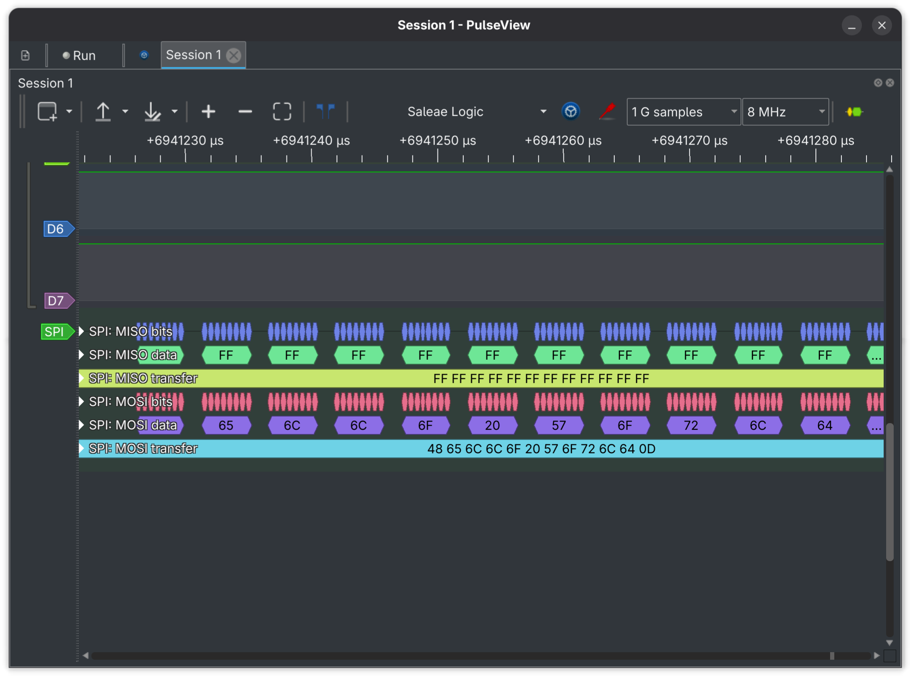
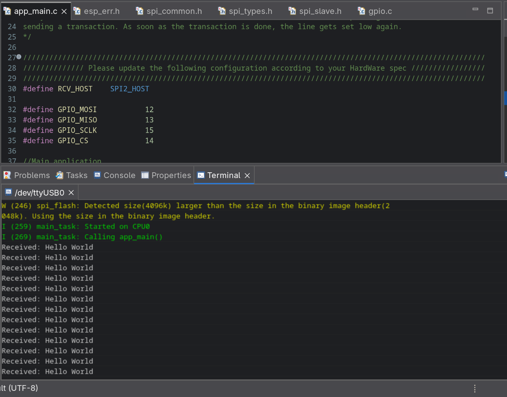

# STM32 ↔ ESP32 SPI Cross-Device Communication

Bare-metal STM32F446RE SPI master communicating with ESP32 WROOM 
SPI slave at 2MHz. Implemented without HAL using 
custom register-level SPI driver on the STM32 side and ESP-IDF 
SPI slave driver on the ESP32 side.

## Hardware
- STM32 Nucleo F446RE (SPI master)
- ESP32 WROOM NodeMCU (SPI slave)
- Logic analyzer (Saleae) for signal verification

## Wiring

| Signal | STM32 Pin | ESP32 GPIO |
|--------|-----------|------------|
| MOSI   | PA7       | GPIO12     |
| MISO   | PA6       | GPIO13     |
| SCLK   | PA5       | GPIO15     |
| CS     | PA4       | GPIO14     |
| GND    | GND       | GND        |

## SPI Configuration

| Parameter    | Value              |
|--------------|--------------------|
| Mode         | 0 (CPOL=0, CPHA=0) |
| Data Frame   | 8-bit              |
| Bit Order    | MSB First          |
| Clock Speed  | 2MHz               |
| NSS          | Software (SSM=1)   |

## Tests Completed
- [x] Simplex TX — STM32 sends Hello World, ESP32 receives and prints
- [ ] Simplex RX — ESP32 sends, STM32 receives
- [ ] Full Duplex — simultaneous bidirectional exchange

## Structure
- `stm32-master/` — bare-metal STM32 SPI driver and master TX code
- `esp32-slave/`  — ESP-IDF SPI slave receiver

## A Problem I Solved
ESP32 received garbage data for over an hour. Logic analyzer 
confirmed STM32 was transmitting Hello World correctly 
(48 65 6C 6C 6F 20 57 6F 72 6C 64). Fault isolated to an 
unconnected MOSI wire. Physical connection fixed, clean 
reception confirmed immediately.

## Verification

### Logic Analyzer — MOSI Signal (PulseView)

### ESP32 Serial Monitor Output

